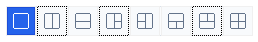

# PD-149 — 版型按鈕失焦後殘留虛線焦點框

Phase 7 · app_shell · Depends on: PD-056, PD-115

- Source: 使用者實機截圖回報（2026-08-30）。
- Origin: 使用者原文：「for 曾經選擇過的 layout, the border 依然殘存虛線，應該修正。」
- Priority: MEDIUM——不影響版型切換功能，但多個舊 layout 同時殘留虛線，會讓使用者誤以為它們仍然取得 focus。



## Outcome

版型按鈕失去 keyboard focus 後，原本的虛線 focus frame 必須立即消失；任何時刻最多只有目前真正取得 focus 的 layout button 顯示 focus frame。既有 active layout 的藍底白圖示、hover、segmented control 外框與八種 layout 的排列不變。

## 已確認的根因（有程式碼證據）

這是 PD-056 之後仍存在的另一個 repaint 缺口，不是 active layout highlight 的判斷錯誤：

1. `WM_CREATE` 在 `src/app_shell/main.cpp:4966-4979` 建立八個 `BS_AUTORADIOBUTTON | BS_OWNERDRAW` layout button。點擊或鍵盤移動 focus 都由 Win32 button 的 `ODS_FOCUS` 狀態反映到 `WM_DRAWITEM`。
2. `draw_layout_button`（`src/app_shell/main.cpp:1093-1124`）先把 `item.rcItem` 縮小 1px 成 `button`，只對 `button` 呼叫 `FillRect`；但 focus frame 卻對完整的 `item.rcItem` 呼叫 `DrawFocusRect`：

   ```cpp
   RECT button = item.rcItem;
   InflateRect(&button, -1, -1);
   // FillRect(item.hDC, &button, ...)
   if ((item.itemState & ODS_FOCUS) != 0)
       DrawFocusRect(item.hDC, &item.rcItem);
   ```

3. `DrawFocusRect` 使用 XOR 方式繪製虛線。focus 移走後，下一次 `WM_DRAWITEM` 不再畫 focus frame，但重繪只覆蓋縮小後的 `button`；完整 `item.rcItem` 外圈原先被 XOR 的像素沒有被覆蓋，所以虛線殘留。
4. PD-056 已在 `layout_header`（`src/app_shell/main.cpp:2062-2108`）對每個 layout button 呼叫 `InvalidateRect(..., FALSE)`，因此 active highlight 的內部像素會更新；`FALSE` 不能替這個外圈 repaint 缺口收尾。`WM_COMMAND` 的 layout click（`src/app_shell/main.cpp:5457-5610`）、Group 切換與 `apply_layout` 都會回到這條既有同步路徑。
5. `layout_button_proc`（`src/app_shell/main.cpp:4402-4432`）目前只追蹤 hover，不應另建一套 focus state；focus 的權威來源仍是 `DRAWITEMSTRUCT::itemState & ODS_FOCUS`。

## 已確認的產品決策

1. **保留 keyboard focus indicator。** 不得直接刪除 `DrawFocusRect`；修正目標是消除失焦後的殘影，同時保留目前 focus 的可見性。
2. **採最小修法：focus frame 使用既有的 inset `button` 矩形。** `draw_layout_button` 既然以 `button` 作為每次重繪的填色範圍，就應以同一個矩形呼叫 `DrawFocusRect`（預期為 `DrawFocusRect(item.hDC, &button)`）。失焦後既有的 `FillRect(&button, ...)` 會覆蓋先前的 XOR 虛線，且不會蓋掉 segmented control 的外圍 1px 邊界。
3. 保留 `InflateRect(&button, -1, -1)`、PD-047 的 active 顏色、PD-058 的 hover 路徑、PD-056 的逐顆 `InvalidateRect(..., FALSE)` 與 PD-115 的八顆按鈕次序。只有真實桌面驗證證明上述矩形仍有殘影時，才可在同一個 owner-draw repaint 路徑加入等價的局部清理；不得用 timer、polling 或新的狀態機繞過問題。

## Binding constraints — quoted, do not go looking for them

`docs/design-spec.md` §4.3：
> 在當前 Group 內可切換八種版型。pane 數量由版型決定。

`docs/design-spec.md` §4.5：
> 恰有一個 pane 為 active，以視覺方式明確指示。點擊 pane 即設為 active；亦提供鍵盤快速鍵在 pane 間移動焦點。

`docs/development.md` Architecture rules：
> `app_shell` | WinMain, STA init, message loop, main window, command routing to the active pane | Model computation, Shell calls

`docs/development.md` Change workflow：
> Make the smallest change that satisfies the acceptance criteria. Reuse before adding.

`AGENTS.md`：
> Prefer the smallest working change. Reuse existing code before adding helpers or abstractions.

`AGENTS.md`：
> Event-driven idle path only. No busy loops, no polling timers.

`AGENTS.md`：
> App UI text must be English. No Chinese strings ship in the binary.

`docs/tickets.md` Agent 交付規則：
> UI ticket 的 Agent checks 應驗證建置、視窗生命週期、狀態資料、訊息與可測的 Win32 結果；視覺人工驗證不屬於本追蹤表，屬於 `docs/testing.md` 的原型驗收協定。

`docs/design-spec.md` §12.5：
> 否決。對 live Shell view 進行 UIAutomation／WinAppDriver 測試極易 flaky，維護成本高於其訊號價值。

## Files to read and trace first

- `docs/design-spec.md` §4.3、§4.5、FR-003、FR-014、§12.4-§12.5。
- `docs/development.md` Architecture rules、UI language、Change workflow；`docs/testing.md` Automated checks、Single seam 與人工驗證規則。
- `docs/tickets/PD-056-layout-button-stale-highlight.md`——既有 active highlight repaint 修法；不可把本票誤當成已完成的 active 狀態修正。
- `docs/tickets/PD-058-hover-feedback-for-interactive-chrome.md`——`layout_button_proc` 的 hover subclass，確認 focus 修法不破壞 hover。
- `docs/tickets/PD-115-order-layout-controls-by-pane-count.md`——目前八顆按鈕的 array/index 對應與實機驗收範圍。
- `src/app_shell/main.cpp:1021-1124`——`draw_layout_glyph`、`draw_layout_button` 的繪製順序、inset 矩形與 `DrawFocusRect`。
- `src/app_shell/main.cpp:2062-2108`——`layout_header` 的排版、checked 同步與 repaint。
- `src/app_shell/main.cpp:2409-2450`——segmented control 共用背景，確認外圍 1px 邊界不能被 layout button 覆蓋。
- `src/app_shell/main.cpp:4402-4432`、`:4966-5004`、`:5206-5229`、`:5457-5610`——hover subclass、button 建立、`WM_DRAWITEM` 與 layout command 的完整 caller flow。

## Scope

1. 修正 `draw_layout_button` 的 focus frame repaint 範圍，使失焦後的舊虛線由既有 owner-draw 填色覆蓋。
2. 追蹤並驗證滑鼠點擊、鍵盤 focus 移動、Group 切換與 `apply_layout` 重新排版等所有 layout button 路徑；只有必要時才調整既有 layout button repaint/subclass code。
3. 在 ticket 交接區記錄自動檢查與真實桌面截圖結果。

## Non-goals

- 不改 active layout 的藍底白圖示、hover 顏色、button 尺寸、間距、glyph、tooltip 或八顆按鈕次序。
- 不移除 keyboard focus indicator，也不改成新的 focus state、timer、polling loop 或 UI framework。
- 不修改 `core`、layout geometry、Group/tab/session persistence、Shell view 生命週期或任何 `IExplorerBrowser` 行為。
- 不順手修正 navigation button、sidebar 或其他 owner-draw control 的 focus frame；若另有實際殘影，另開 ticket。
- 不引入 UIAutomation／WinAppDriver 測試或新的測試 framework。

## Acceptance criteria

1. 啟動 Release build，在同一 Group 依序點選八個 layout button，至少包含非相鄰順序（例如 `Single → Two beside One → Two over One → Four`）；每次切換後 active 藍色高亮正確，先前取得 focus 的 button 不留下虛線。
2. 讓 focus 從 layout button 移到另一個 layout button，再移到 address bar、Group list 或 pane；任何失去 focus 的 layout button 都恢復乾淨的背景，不能留下虛線殘影。
3. 切換到 layout 不同的 Group，再切回原 Group；八顆 button 中只有實際取得 focus 的 button 可有 focus frame，active highlight 仍只對應當前 Group 的 layout。
4. 在目前支援的 DPI（至少 96 DPI 與一個非 96 DPI）重複上述操作；segmented control 的共用外框、1px 分隔與 button 內部繪製沒有被破壞，沒有可察覺的閃爍。
5. `cmake --build build`、`ctest --test-dir build --output-on-failure` 全數通過。
6. `git diff --check` 通過。

這是 `app_shell` 的 Win32 owner-draw repaint 修正，不新增 `core` 可測邏輯；依 `docs/testing.md` 的 single-seam 決策，不另建 unit-test framework。實機截圖與 focus 移動結果是本票必要的 focused self-check；若當次環境沒有可互動桌面，必須記錄 `未驗證，需真實桌面`，不得以 source inspection 宣稱視覺驗收通過。

## Agent checks

```powershell
cmake -S . -B build -G Ninja -D"CMAKE_TOOLCHAIN_FILE=cmake/llvm-mingw.cmake" -DCMAKE_BUILD_TYPE=Release
cmake --build build
ctest --test-dir build --output-on-failure
```

```powershell
rg -n "draw_layout_button|DrawFocusRect|ODS_FOCUS|layout_header|layout_button_proc|layout_buttons" src\app_shell\main.cpp
git diff --check
```

```powershell
.\build\PaneDock.exe
# 真實桌面人工操作：依序點選八顆 layout button，並把 focus 移到另一顆、address bar、Group list、pane。
# 每一個狀態用 PrintWindow(hwnd, hdc, 2 /* PW_RENDERFULLCONTENT */) 截圖，確認舊 focus frame 消失。
# 不使用 UIAutomation／WinAppDriver，不合成鍵盤或滑鼠輸入。
```

測試後使用不帶 `/F` 的 `taskkill /PID <pid>` 優雅關閉，不要使用 `Stop-Process -Force`。

## Handoff requirements

- 記錄最後採用的 focus frame 矩形與 repaint 路徑；確認是否只改 `draw_layout_button`。
- 記錄八顆 layout button 的實機操作序列，以及每次前一個 focus frame 已清除的截圖結果。
- 記錄 focus 移到 address bar、Group list、pane 後的結果；若仍有殘影，附上具體 button index、DPI 與重現步驟。
- 記錄 CMake、build、CTest、`rg` 與 `git diff --check` 結果。

## 交接區

<!-- 實作 agent 填寫，append-only -->

### 2026-08-30 實作交接

- `src/app_shell/main.cpp:1123` 是本票唯一的產品程式修改：`draw_layout_button` 將 `DrawFocusRect` 的矩形從完整 `item.rcItem` 改為既有的 inset `button`；未修改 active、hover、layout mapping 或其他 caller。
- Release build 真實桌面驗證序列：`Four → Single → Two beside One → Two over One → Four → Left / Right → Top / Bottom → Three → One over Two`；八顆 layout button 均完成切換，每次截圖皆未見前一個按鈕留下虛線。接著將 focus 移到 address bar（`ID: 330`），再切換 `Group 1 → Odoo`；兩條路徑均未復活虛線。驗證後已將 Odoo 還原為原先的 `Four` 版型並關閉程序。
- 自動檢查：CMake configure PASS；`cmake --build build` PASS；排除既有 `panedock_launch_smoke` 的 10 項 CTest 全數 PASS；`rg` 檢查與 `git diff --check` PASS。
- 完整 `ctest --test-dir build --output-on-failure` 目前為 10/11 PASS；`panedock_launch_smoke` 連續獨立重跑兩次都在既有關閉路徑失敗（`PaneDock did not exit after its main window was closed.`）。這是 shutdown smoke，與本次單行 owner-draw 繪製修正無關；未在本票擴大修改 shutdown，故 tracker 暫列 `in_progress`。
- 尚未在非 96 DPI 顯示縮放下實測；需有對應桌面環境後再補做 acceptance criterion 4，並在確認 full CTest smoke 修復後再改為 `done`。

### 2026-08-30 shutdown smoke 診斷補記

- 追查原先 `panedock_launch_smoke` 的 30 秒逾時：sandbox 對真實 `%LOCALAPPDATA%\PaneDock` 沒有寫入權限，啟動前 `session.json.tmp` 建立即回 `ERROR_ACCESS_DENIED`；app 因此顯示儲存警告，`CloseMainWindow()` 被巢狀 modal loop 攔住，表面上像 shutdown 未退出。
- 未修改 shutdown 或測試 harness。先備份並於測試後還原 session 檔案後，以提升權限執行 Release full CTest，11/11 PASS，`panedock_launch_smoke` 0.91 秒 PASS；目前無殘留 PaneDock/lldb process。
